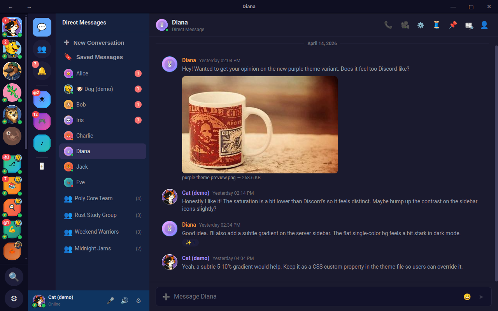

# Poly — Your AI-Powered Social Layer

A cross-platform messenger that unifies all your chat accounts — Discord, Matrix, Stoat, Teams, Hacker News, Lemmy, GitHub, self-hosted servers — into a single app with an AI agent that remembers, responds, and manages your social life. Built in **Rust** with **Dioxus 0.7.3**, powered by **WASM Component Model** plugins.



**Status (2026-05-11):** All 3 platform shells working with SSR hydration + host-bridge unification. 12 client backends (demo, stoat, matrix, discord, teams, poly-server, hackernews, lemmy, github, forgejo, reddit, poly-cli). Plugin capability system live. **Host sandbox shipped end-to-end** across Wry / Electron / Web — Discord captcha + Teams OAuth popups now work natively without leaving the app. Phase 5 (Social Agent) in progress. Next up: **Discord anti-ban hardening** + **voice/video calls (Discord + Stoat)** — design plans landed in `docs/plans/plan-discord-anti-ban.md` and `docs/plans/plan-voice-video-calls.md`.

---

## Vision

Poly is not just a multi-client chat app. It's a **personal AI-powered social agent** that sits on top of all your messaging platforms.

**The problem:** Your conversations are scattered across 5+ apps. You miss messages, forget what people told you, lose links, and can't keep up with every chat. Switching between Discord, Teams, Matrix, and Stoat wastes hours.

**Poly solves this in two layers:**

### Layer 1 — Unified Chat UI
All your accounts from every platform in one app. One sidebar, one message view, one notification stream. Switch between your Discord server and your Matrix Space without switching windows.

### Layer 2 — Social Agent
An AI agent that connects to all your chat backends via MCP and acts as your external social memory:

- **Catches you up** — "What did I miss in #general?" gets a 3-sentence summary, not 200 messages to scroll
- **Remembers everything** — Who said what, when, what links were shared, what you promised, what they asked for
- **Responds as you** — With your tone, your humor, per-person personality, learned from how you actually write
- **Keeps relationships alive** — "Message Alice about something interesting every week" runs in the background
- **Finds anything** — "What was that article Bob sent about WebRTC 2 months ago?" — instant answer across all backends
- **Prioritizes** — VIP contacts surface immediately, noise batches into a daily digest

The agent shares your live connections — no duplicate logins. You can switch between responding yourself and letting the agent handle it, per-chat, at any time. Bring your own AI provider (Claude, GPT, Gemini, Ollama).

---

## Architecture

### WASM Plugin Architecture

All messenger backend implementations are compiled to **WebAssembly Component Model** plugins (not embedded directly in the app).

**Why WASM?**
- **App store compliance**: No hardcoded API keys, no library licensing conflicts
- **Modular updates**: Update individual backends without rebuilding the entire app
- **Offline-first**: Clients load from disk cache — instant startup
- **Native + Web**: Same WASM binaries run on desktop (via Wasmtime), Android, iOS, and web browsers
- **Security boundary**: Guest code (backend) isolated from host (UI) via component model

### Client Backends

| Backend | Type | Status |
|---------|------|--------|
| **Demo** | Chat | Fully functional mock backend for UI development |
| **Stoat** | Chat | Revolt REST+WS client — core flow working |
| **Matrix** | Chat | Custom HTTP client (no matrix-sdk) — stub |
| **Discord** | Chat | Discord API client — dev-only, TOS gated |
| **Teams** | Chat | Microsoft Graph API — dev-only, TOS gated |
| **Poly Server** | Chat | First-party poly-server protocol client |
| **Hacker News** | Forum | HN Firebase API — read-only, forum model |
| **Lemmy** | Forum | Lemmy REST API v3 — federated forum |
| **GitHub** | Forge | GitHub Issues/PRs/notifications + source explorer |
| **Forgejo** | Forge | Forgejo/Gitea/Codeberg repos, issues, PRs + source explorer |
| **Reddit** | Forum | old.reddit.com HTML scraper — full read/write incl. submit, comment, vote, edit, delete, DM |
| **poly-cli** | Chat | Dynamic CLI client for the chat MCP |

### Plugin System

Each backend plugin exports standard WIT (WebAssembly Interface Types):

```wit
package poly:messenger

interface messenger-client {
  get-backend-type() -> backend-type
  get-backend-name() -> string
  create-session(...) -> session
  // ... full API defined in WIT
}
```

- **Registry** (`crates/plugin-host/src/registry.rs`): Scans for `*.wasm` files, instantiates via wasmtime, verifies identity via WIT exports
- **Dynamic Linking** (`poly-plugin-host`, `crate-type = ["dylib"]`): wasmtime isolated behind dynamic linking boundary — poly-core changes never recompile it
- **Capability System**: Plugins declare required capabilities; settings panel shows capability grants per-plugin

---

## Platform Targets

| Platform | Shell | Port | Debug Port | Status |
|----------|-------|------|------------|--------|
| **Web** | Chrome/Chromium | 3000 | 9222 (CDP) | Working |
| **Desktop (Wry)** | `apps/desktop-web` (WebKit2GTK) | 3002 | 9223 (HTTP eval) | Working |
| **Desktop (Electron)** | `apps/desktop-electron-web` | 3001 | 9224 (CDP) | Working |
| **Mobile iOS** | Dioxus iOS | — | — | Planned |
| **Mobile Android** | Dioxus Android | — | — | Planned |

All three working shells use the same pattern:
1. `dx serve --platform web --fullstack` compiles the app as WASM + native axum server
2. A thin native shell (Chrome / Wry / Electron) loads from the dev server
3. On code changes, only the WASM reloads — the native window stays alive
4. The MCP reconnects via CDP or eval-bridge after each rebuild

### Host-Bridge (`/host/*`)

Every shell mounts the same `/host/*` route set on the **same port as its WASM bundle** — one process, one port. The Dioxus fullstack server owns the shared SQLite file and serves both the WASM bundle and `/host/*` routes.

Routes: `GET /host/status`, `POST /host/kv/{get,set,delete,clear}`, `POST /host/exec`, `POST /host/http`, `POST /host` (legacy dispatch).

Storage: `storage.sqlite3` in the OS data dir (`~/.local/share/poly/` on Linux, `~/Library/Application Support/poly/` on macOS, `%APPDATA%\poly\` on Windows). Override with `POLY_DATA_DIR`.

---

## Project Structure

```
poly/
├── clients/              # 10 backend implementations
│   ├── client/           # poly-client: shared types (source of truth)
│   ├── demo/             # Fully functional mock backend
│   ├── stoat/            # Revolt API client
│   ├── matrix/           # Matrix custom HTTP client
│   ├── discord/          # Discord API (dev-only)
│   ├── teams/            # Teams API (dev-only)
│   ├── server-client/    # Poly server protocol client
│   ├── hackernews/       # HN Firebase API (forum)
│   ├── lemmy/            # Lemmy REST API v3 (forum)
│   ├── github/           # Git forge: GitHub/GHE via gh CLI
│   ├── forgejo/          # Git forge: Forgejo/Gitea/Codeberg via REST API
│   └── reddit/           # old.reddit.com HTML-scrape backend (forum)
│
├── apps/                 # Platform entry points
│   ├── web/              # Browser (Dioxus fullstack + Axum, port 3000)
│   ├── desktop/          # Desktop entry point (Dioxus fullstack, port 3002)
│   ├── desktop-web/      # Wry shell (loads from desktop's dev server)
│   ├── desktop-electron/ # Electron entry point (Dioxus fullstack, port 3001)
│   ├── desktop-electron-web/ # Electron thin shell (loads from electron's dev server)
│   ├── poly-host/        # Standalone host-bridge daemon (port 9333)
│   ├── desktop-blitz/    # WGPU native GPU rendering (experimental)
│   ├── android/          # Mobile (planned)
│   └── ios/              # Mobile (planned)
│
├── crates/
│   ├── core/             # poly-core: UI, routing, plugin host runtime
│   ├── plugin-host/      # WASM plugin host (wasmtime, dynamic linking)
│   ├── plugin-host-tests/# Integration + E2E tests
│   ├── host-bridge/      # HTTP client abstraction (native reqwest / WASM bridge)
│   ├── host-sandbox/     # Per-shell browser-popup sandbox for OAuth/captcha (Wry, Electron, Web)
│   └── social-agent/     # AI agent (Phase 5)
│
├── servers/
│   ├── server/           # Poly sync server (Axum)
│   ├── backup-server/    # Encrypted backup service
│   └── test-matrix/      # Mock test servers
│
├── mcp/                  # Model Context Protocol servers
│   ├── desktop-devtools-mcp/  # Desktop MCP (port 9223)
│   ├── electron-devtools-mcp/ # Electron MCP (port 9224)
│   ├── web-devtools-mcp/      # Web MCP (port 9222)
│   ├── memory-mcp/            # Project memory MCP
│   └── devtools-protocol/     # Shared protocol library
│
├── docs/                 # Numbered documentation (see docs/INDEX.md)
│   ├── 0-project/        # Vision, roadmap, work plan
│   ├── 1-architecture/   # Overview, WASM plugins, host bridge, storage
│   ├── 2-clients/        # Per-client docs (demo, stoat, matrix, etc.)
│   ├── 3-platforms/       # Per-platform docs (web, desktop, electron)
│   ├── 4-ui/             # Component architecture, chat scroll, forum, mobile
│   ├── 5-testing/        # Test architecture, test servers, MCP devtools
│   ├── 6-ai-agent/       # Social agent, MCP chat server, poly-cli, memory
│   ├── 7-infrastructure/ # Poly server protocol, backup server
│   └── archive/          # Historical phase plans (reference only)
│
└── wit/                  # WIT interface definitions
    └── messenger-plugin.wit
```

---

## Getting Started

### Running the Web App (fullstack with host-bridge)

```bash
cd apps/web
dx serve --platform web --fullstack \
  @client --no-default-features --features "dev-plugins,web" \
  @server --platform server --no-default-features --features "dev-plugins,server"
```

The `@server --platform server` flag is required — without it dx tries to build the server half for wasm32 and fails.

### Running Desktop (Wry)

```bash
cd apps/desktop
dx serve --platform web --fullstack \
  @client --no-default-features --features "dev-plugins,web" \
  @server --platform server --no-default-features --features "dev-plugins,server"
# Then launch the Wry shell pointing at port 3002
```

### Running Desktop (Electron)

```bash
cd apps/desktop-electron
dx serve --platform web --fullstack \
  @client --no-default-features --features "dev-plugins,web" \
  @server --platform server --no-default-features --features "dev-plugins,server"
# Then launch Electron pointing at port 3001
```

### Run Tests

```bash
# Workspace check
cargo check --workspace

# Lints (zero-warning policy)
cargo cranky --workspace

# Unit tests
cargo test --workspace

# WASM build verification
cd apps/web && dx build --platform web
```

### Dev-only Backends — Discord, Microsoft Teams, Reddit

Discord, Teams, and Reddit are gated behind `dev-plugins` — on by default for development, excluded in production builds:

```bash
# Dev (default — discord + teams + reddit visible in Settings → Plugins)
cd apps/web && dx serve --platform web --fullstack ...

# Production (no discord, no teams, no reddit)
cd apps/web && dx build --platform web --release \
    --no-default-features --features production
```

> **⚠️ NOT BAKED IN — USE AT YOUR OWN RISK.**
>
> These three backends are present **strictly for API and feature-completeness exploration** of forum-/chat-shaped backends. They are **not** included in any release artifact, are **not** supported, and were never built as a path to commercial use.
>
> - **Discord** and **Microsoft Teams** TOS explicitly prohibit third-party clients. Using these backends with a real account can get the account terminated. The `docs/plans/plan-discord-anti-ban.md` work hardens fingerprinting + rate-limit guardrails to *minimise* that risk, not eliminate it.
> - **Reddit**'s TOS similarly restricts scraping clients. The plugin scrapes `old.reddit.com` HTML — same risk shape.
> - The source is MIT-licensed and open so anyone studying the architecture can read it. **Don't ship it. Don't run it against an account you care about.** If you do anyway, that's on you.

### Project scope

**Poly is a research and friends-only project.** No commercial interest, no monetisation path, no enterprise support, no SLA. The author and contributors will not provide support — open issues exist for tracking, not for help. If something doesn't work, read the source.

---

## Chat UI

The chat view uses a **column-reverse CSS layout** (newest messages at bottom, `scrollTop=0`).

| Feature | Description |
|---------|-------------|
| **Infinite scroll** | Older messages at top edge, newer at bottom — 50-message pages, up to 200 in memory |
| **Scroll position memory** | Returning to a channel restores exact scroll position |
| **View anchor restore** | Re-entry loads messages around last-viewed message with pixel-exact viewport restore |
| **Jump to Present** | One-click return to live tail with "Viewing Older Messages" subtitle |
| **Unread divider** | Red "NEW" line persists until channel switch (Discord-style) |

See [docs/4-ui/4.1-chat-scroll-and-history.md](docs/4-ui/4.1-chat-scroll-and-history.md) for the full implementation spec.

---

## Forum Channels

Poly supports **forum-style channels** for backends like Hacker News, Lemmy, and GitHub:
- Thread list view with vote counts, author, and timestamps
- Nested comment trees with collapsible threads
- Read-only and read-write modes per backend

See [docs/4-ui/4.2-forum-channels.md](docs/4-ui/4.2-forum-channels.md).

---

## UI Themes

Poly includes **3 built-in themes** + custom CSS editor:

- **Neutral Dark** (default): Cool, minimal aesthetic
- **Purple** (Discord): Discord brand colors
- **Red** (Stoat): Stoat/Revolt brand colors

Customize every color via CSS custom properties, import/export theme files.

---

## Security & Privacy

- **Local database**: SQLite-backed offline-first storage (no cloud sync by default)
- **Backup encryption**: All data encrypted before leaving device (AES-256-GCM)
- **Identity**: Ed25519 keypair + X25519 derived keys + BIP39 recovery phrase
- **Tokens**: Backend credentials stored locally
- **Proof-of-Work**: Backup server uses PoW challenge for auth

---

## Localization (i18n)

User-facing strings via **Project Fluent** (`.ftl` files):

- **English** (default)
- **German**
- **French**
- **Spanish**

Located in `locales/` directory.

---

## Documentation

All project documentation lives in [`docs/`](docs/INDEX.md), organized by layer:

| Section | Contents |
|---------|----------|
| [0 — Project](docs/0-project/) | Vision, roadmap, work plan |
| [1 — Architecture](docs/1-architecture/) | System overview, WASM plugins, host bridge, storage |
| [2 — Clients](docs/2-clients/) | Per-client backend documentation |
| [3 — Platforms](docs/3-platforms/) | Per-platform shell documentation |
| [4 — UI](docs/4-ui/) | Component architecture, chat scroll, forum, mobile |
| [5 — Testing](docs/5-testing/) | Test architecture, mock servers, MCP devtools |
| [6 — AI Agent](docs/6-ai-agent/) | Social agent vision, MCP chat server, poly-cli |
| [7 — Infrastructure](docs/7-infrastructure/) | Poly server protocol, backup server |

See [docs/INDEX.md](docs/INDEX.md) for the full index with status markers.

---

## Contributing

See [docs/INDEX.md](docs/INDEX.md) for architecture documentation. Read the relevant `README.md` in each crate/app before making changes.

**Before committing:**
- [ ] `cargo check --workspace` passes
- [ ] `cargo cranky --workspace` has zero warnings
- [ ] `cargo fmt --all` applied
- [ ] Changes tested manually (especially poly-core via DevTools)

---

## License

Dual licensed under **MIT** or **Apache-2.0**.

---

**Last Updated:** 2026-05-11
**Roadmap:** ✅ Phase 3 (12 backends shipped, latest: Reddit) → ✅ Host sandbox (Wry/Electron/Web) → 🚧 Discord anti-ban hardening + voice/video calls (Discord + Stoat) → Phase 5 (social agent, in progress)
